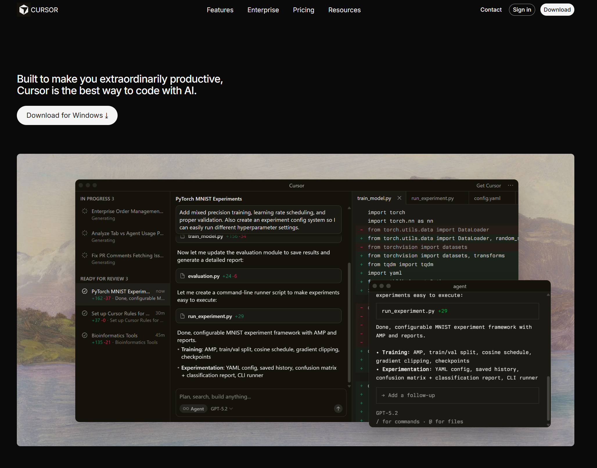
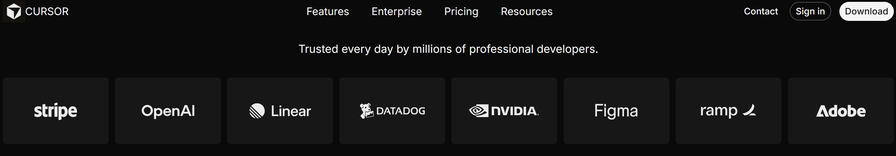
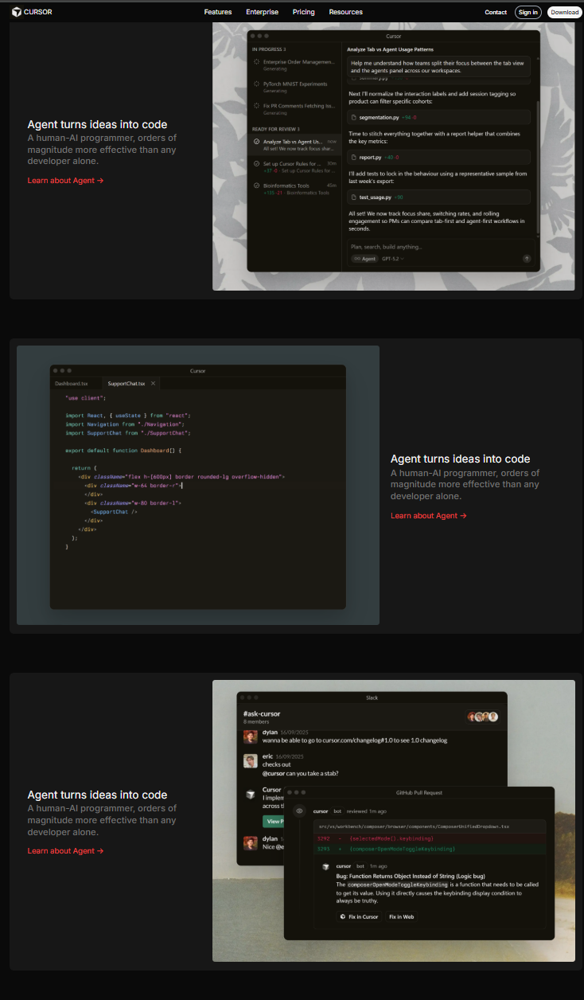
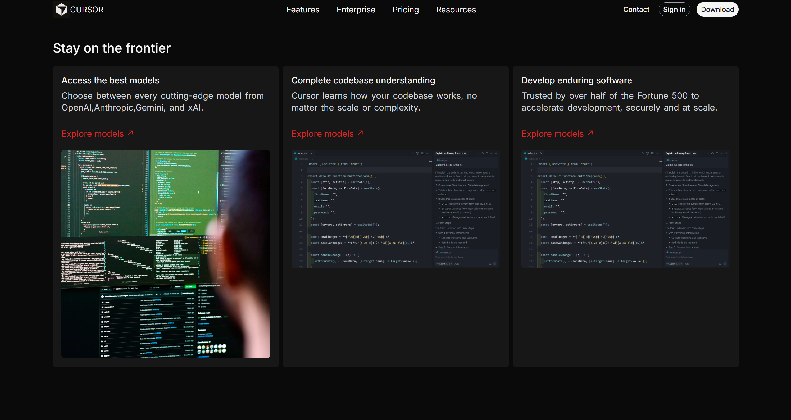
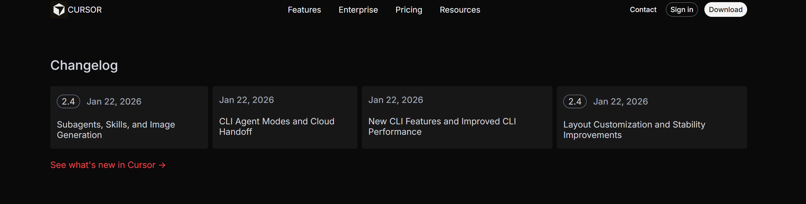
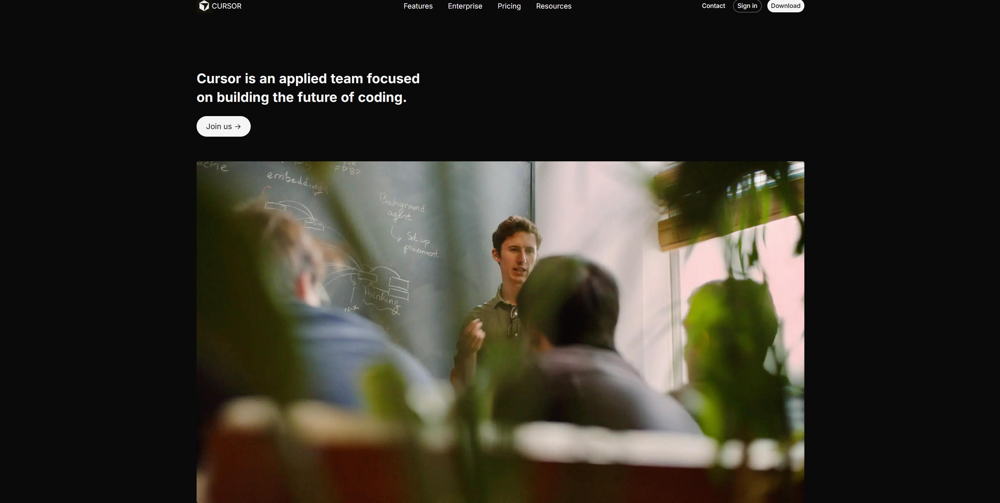
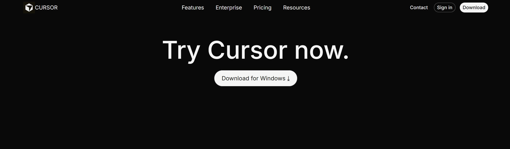
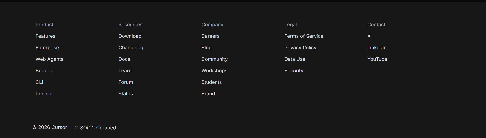

# Cursor Landing Page Clone

This project is a **static clone of the Cursor landing page**, built using **only HTML and CSS**.  
The goal of this assignment was to practice **layout, spacing, typography, and visual accuracy** by closely recreating a real-world product website.

---

## Assignment Structure

- **index.html** – Contains the markup for the landing page
- **style.css** – Handles all styling, layout, colors, and typography
- **public/** – Stores all images, icons, and SVG assets used on the page
- **layouts-screenshots/** - Stores all the screenshots for different sections of the page.

---

## 🛠️ Tech Stack

- **HTML5**
- **CSS3**

---

## Fonts & Colors Used

### Font Family

- **Inter**, sans-serif  
  Imported and used across the entire layout:
  ```css
  font-family: "Inter", sans-serif;
  ```

## Project Color Palette

This project uses a dark, minimal UI color system.

**Backgrounds**

- Main Background: `#0a0a0a`
- Section / Card Background: `#171717`

**Text Colors**

- Primary Text: `#f5f5f5`
- Secondary Text: `#d1d5db`
- Muted Text: `#9ca3af`, `#737373`

**CTA**

- CTA: `#ef4444`
- Accent Hover / Emphasis: `#dc2626`

**Borders & UI Elements**

- Borders: `#6b7280`
- Subtle UI Borders: `#404040`

## What I Built

This project recreates the **visual layout and structure** of the Cursor landing page, including:

- Top Navigation Bar


- Hero Section



- Trusted By / Company Logos



- Feature Sections



- Features Card Section with text and image in one card



- Changelog / Updates



- Team / About Section



- Final CTA



- Footer


